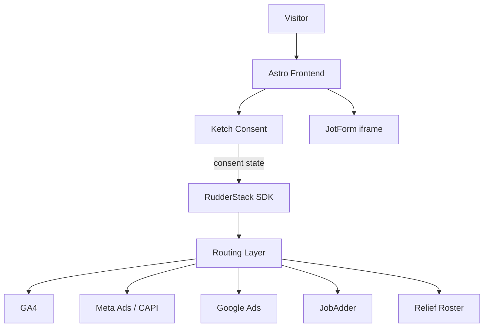

# Website data, consent & tracking architecture

Astro (frontend) + Strapi (CMS) with a consent-first, event-driven data pipeline.

## Stack overview

| Layer | Tool | Role |
|-------|------|------|
| Frontend | Astro | Static marketing site |
| CMS | Strapi V2 | Content, global tracking config |
| Consent | **Ketch** | Banner, preferences, regional compliance, audit trail |
| Tracking | **RudderStack** | Event SDK, routing, transformations, destinations |
| Forms | Native Strapi (`form-submission`) + legacy JotForm embed | Lead capture; RudderStack events on view/submit |
| Optional | GTM | Marketing widgets only — **not** primary tracking |

## Architecture diagram

## Key principles

1. **Consent-first** — no tracking without Ketch consent handling
2. **Event-driven** — structured events, not pixel scripts
3. **Single source of truth** — event names defined in [`apps/web/src/lib/analytics/events.ts`](../../apps/web/src/lib/analytics/events.ts)
4. **Centralised routing** — RudderStack controls all outbound flows
5. **Extensible** — structured events ready for warehouse / AI pipelines

## Event catalog (initial)

| Event | When | Key properties |
|-------|------|----------------|
| `Page Viewed` | Every page load (after consent) | region, locale, pageType, pagePath |
| `Form Viewed` | JotForm iframe visible | region, jotformId, pagePath |
| `Job Viewed` | Job detail viewed | jobId, region, source |
| `Application Started` | Apply flow begun | jobId, region |
| `Application Submitted` | Application complete | jobId, region, candidateId |

Each event includes campaign context (UTM), consent purposes, and region.

## Consent enforcement

Ketch determines allowable data usage. RudderStack receives consent state and:

- Blocks destinations when marketing/analytics denied
- Filters or anonymises properties where required
- Only loads SDK after essential + permitted purposes resolved

| Consent | Behaviour |
|---------|-----------|
| Analytics allowed | GA4 destination receives events |
| Marketing denied | Meta / Google Ads blocked |
| Partial | RudderStack transformations apply |

## CMS configuration

Strapi **Global Settings** (`global-setting`):

| Field | Purpose |
|-------|---------|
| `ketchEnabled` | Load Ketch |
| `ketchOrganizationCode` | Ketch org |
| `ketchPropertyCode` | Ketch property / experience |
| `rudderStackEnabled` | Enable event pipeline |
| `rudderStackWriteKey` | RudderStack source write key |
| `rudderStackDataPlaneUrl` | RudderStack data plane URL |
| `optionalGtmContainerId` | Optional GTM for widgets only |

Env fallbacks: `PUBLIC_KETCH_ORG`, `PUBLIC_KETCH_PROPERTY`, `PUBLIC_RUDDERSTACK_WRITE_KEY`, `PUBLIC_RUDDERSTACK_DATA_PLANE_URL`.

**POC account (free tier):** org `anzuk`, property `website_smart_tag` — boot URL  
`https://global.ketchcdn.com/web/v3/config/anzuk/website_smart_tag/boot.js`

## Frontend implementation

| File | Role |
|------|------|
| `components/seo/KetchConsent.astro` | Ketch boot + dev fallback banner |
| `components/seo/RudderStackHead.astro` | SDK load, page events, consent gate |
| `lib/analytics/events.ts` | Event name constants |
| `lib/analytics/consent.ts` | Consent state bridge |
| `lib/analytics/rudderstack.ts` | track / page / identify wrappers |
| `lib/marketing-identity.ts` | UTM capture, JotForm prefill (unchanged) |

## Destinations (RudderStack Cloud — not in repo)

Configure in RudderStack dashboard:

1. **GA4** — analytics destination, filter: analytics consent
2. **Meta** — web + CAPI, filter: marketing consent
3. **Google Ads** — conversion API, filter: marketing consent
4. **JobAdder** — webhook/API on `Application Submitted`
5. **Relief Roster** — internal webhook on relevant events

## GTM (optional, reduced role)

Retain GTM only if marketing needs self-serve widget injection. Do **not** configure GA4/Meta pixels in GTM — those flow through RudderStack.

## Next steps

See **[Marketing data platform setup checklist](../future/marketing-data-setup.md)** for Ketch and RudderStack task lists (POC vs to-do).

Summary:

1. Finish Ketch purpose/experience configuration in dashboard (regional banners, purpose codes)
2. Provision RudderStack source + wire write key / data plane URL
3. Configure destinations in RudderStack with consent filters mapped to Ketch purposes
4. Define JobAdder / Relief Roster webhook payloads for `Application Submitted`
5. Add server-side Meta CAPI destination (RudderStack cloud mode)
6. Event QA: RudderStack Live Events + destination debugger
7. Remove legacy GTM/Cookiebot env vars from production secrets once migrated

## Future

- Azure / Fabric warehouse as RudderStack destination
- Consent-aware AI copilot data access
- JobAdder live integration replacing stub
