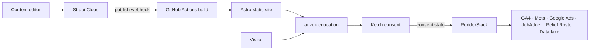
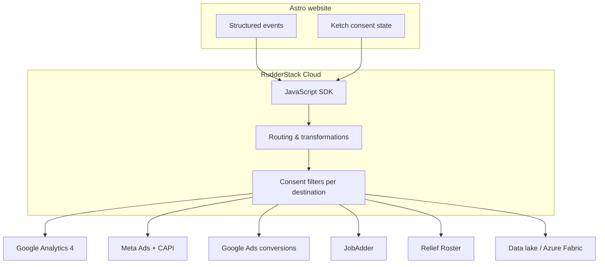
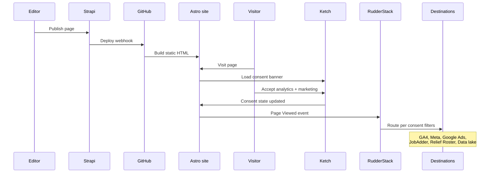

# ANZUK Global Marketing Hub — Tech Stack Overview

A walkthrough of the technology choices behind the current prototype, written for team demos and stakeholder onboarding.

**Markets served:** International hub, Australia, United Kingdom, Canada, New Zealand (United States via [Scoot Education](https://scoot.education) — external link).

---

## At a glance

| Layer | Technology | Role |
|-------|------------|------|
| Frontend | **Astro** | Fast, static marketing site — built for SEO and machine-readable content |
| CMS | **Strapi Cloud** | Headless content management — editors publish, site rebuilds |
| Consent | **Ketch** | Cookie banner, preferences, regional privacy compliance |
| Data & analytics | **RudderStack** | Event collection, consent-aware routing to all downstream systems |
| Hosting (prototype) | GitHub Pages | Static deploy on every Strapi publish |
| Brand system | `@anzuk/brand` | Shared design tokens, fonts, and assets across all markets |



---

## Astro — why we chose it

[Astro](https://astro.build) is the frontend framework for the marketing site. It generates **static HTML** at build time, pulling content from Strapi via the REST API.

### Why Astro fits ANZUK

1. **Performance by default** — Astro ships zero JavaScript unless a component explicitly needs it. Marketing pages are lean HTML + CSS, which keeps load times fast across all regions.
2. **Static output** — `output: 'static'` means every page is pre-rendered at build time. No server required at runtime; ideal for global CDN hosting.
3. **Multi-region from one codebase** — A single Astro project serves International, AU, UK, CA, and NZ via subdirectory routing (`/au/`, `/uk/`, etc.) with shared components and per-region content.
4. **Editor-friendly builds** — When an editor publishes in Strapi, a webhook triggers a rebuild. The site updates within minutes without developers touching code.
5. **Maintainable monorepo** — The site lives in `apps/web` alongside `apps/cms` (Strapi) and `packages/brand` (design system).

### SEO advantages

Astro was selected specifically for **SEO-first** delivery:

| Capability | How we use it |
|------------|---------------|
| **Pre-rendered HTML** | Search engines receive complete page content immediately — no client-side rendering delay |
| **Subdirectory localisation** | Regional sites at `/au/`, `/uk/`, etc. consolidate domain authority on one domain |
| **Canonical & hreflang tags** | Every regional page emits correct `canonical` and `alternate` links for international SEO |
| **CMS-driven meta** | Title, description, and `noindex` flags come from Strapi SEO fields |
| **JSON-LD structured data** | Automated schema for `WebSite`, `Organization`, and `WebPage` — helps Google understand page intent |
| **XML sitemap** | `@astrojs/sitemap` integration with per-locale entries (`en-AU`, `en-GB`, `en-CA`, `en-NZ`) |
| **Core Web Vitals** | Minimal JS and static delivery support strong Lighthouse scores — a ranking signal |

### AI & machine-readability advantages

Beyond traditional SEO, the site is built to be **understood by AI systems** (search generative experiences, answer engines, and future internal AI tools):

| Capability | Benefit |
|------------|---------|
| **Semantic HTML** | Proper use of `<article>`, `<section>`, headings, and landmarks gives machines a clear content hierarchy |
| **Structured data (JSON-LD)** | Schema.org markup makes services, locations, and page types machine-parseable |
| **Clean, text-first pages** | Static HTML without heavy client frameworks means crawlers and LLMs get the full content in one pass |
| **Consistent event schema** | RudderStack events use canonical names (`Page Viewed`, `Application Submitted`, etc.) — ready for warehouse ingestion and AI pipelines |
| **Headless CMS separation** | Content in Strapi is structured (regions, page types, blocks) rather than buried in page builder HTML — easier to feed into RAG or content AI tools later |

> **Production target:** The prototype deploys to GitHub Pages. The long-term plan is Azure Static Web Apps + Cloudflare edge routing — the Astro build output stays the same; only hosting changes.

---

## Strapi Cloud — our content source of truth

[Strapi](https://strapi.io) is a headless CMS: editors manage content in an admin UI; the marketing site consumes it via API.

### Why Strapi Cloud (prototype)

For the current proof-of-concept we use **Strapi Cloud** rather than self-hosting:

- **Fast editor onboarding** — marketing team gets a shared admin URL immediately, no server setup
- **No infrastructure management** — database, backups, and hosting handled by Strapi
- **Same API contract as production** — migrating to self-hosted Azure later only requires changing `STRAPI_URL`
- **Local development** — schema work happens in `apps/cms/` and syncs to Strapi Cloud

### What lives in Strapi

| Content | Purpose |
|---------|---------|
| **Pages** | Regional marketing pages built from reusable blocks (hero, feature grid, lead form, etc.) |
| **Regions** | AU, UK, CA, NZ configuration — navigation, footer, policy links |
| **Articles** | Regional blog posts |
| **Global Settings** | Ketch org codes, RudderStack keys, optional GTM container, external URLs |
| **Form Submissions** | First-party lead capture stored directly in Strapi |

### Publish → deploy flow

1. Editor creates or updates content in Strapi Cloud
2. Editor clicks **Publish**
3. Strapi fires a webhook to GitHub Actions
4. Astro fetches fresh content and builds static HTML (~3–5 minutes)
5. Updated site is live on GitHub Pages

This means **content changes do not require a developer** — only schema or new component types do.

---

## Ketch — consent & privacy

[Ketch](https://www.ketch.com) is our **consent management platform (CMP)**. It replaces the older GTM + Cookiebot approach with a modern, purpose-based consent model.

### What Ketch does

| Function | Detail |
|----------|--------|
| **Consent banner** | Shows on first visit; respects regional privacy requirements (GDPR, CPRA, Australian Privacy Act) |
| **Preference centre** | Visitors can accept or deny specific purposes (Analytics, Marketing, etc.) |
| **Purpose enforcement** | Consent state is passed to RudderStack — no tracking fires without permission |
| **Audit trail** | Ketch records consent decisions for compliance reporting |
| **CMS-configurable** | Org and property codes stored in Strapi Global Settings (with env fallbacks) |

### How it connects

```
Visitor lands on site
    → Ketch smart tag loads (KetchConsent.astro)
    → Visitor makes consent choices
    → Ketch emits consent state
    → RudderStack SDK initialises only when permitted purposes are granted
    → Destinations receive events only if consent allows
```

**POC configuration:** org `anzuk`, property `website_smart_tag`.

Ketch is the **gatekeeper**. Nothing in the analytics or marketing stack runs until Ketch says it can.

---

## RudderStack — our data nerve centre

[RudderStack](https://www.rudderstack.com) is a **customer data platform (CDP)** that collects structured events from the website and routes them to every downstream system — with consent filters applied centrally.

This replaces Google Tag Manager as the **primary tracking layer**. We no longer embed GA4, Meta, or Google Ads pixels directly in the site. Instead, the Astro app fires clean events; RudderStack decides where they go.

### Key principles

1. **Consent-first** — Ketch gates the RudderStack SDK; events include consent properties
2. **Event-driven** — structured events, not ad-hoc pixel scripts
3. **Single source of truth** — canonical event names defined in `apps/web/src/lib/analytics/events.ts`
4. **One event → many destinations** — e.g. one `Application Submitted` can flow to GA4, Meta, JobAdder, and Relief Roster simultaneously
5. **Extensible** — same pipeline feeds marketing tools today and a data lake tomorrow

### Architecture



### Event catalog

| Event | When it fires | Key properties |
|-------|---------------|----------------|
| `Page Viewed` | Page load (after analytics consent) | region, locale, pageType, pagePath |
| `Form Viewed` | Lead form scrolls into view | region, formType, pagePath |
| `Form Submitted` | Native Strapi form submitted | region, formType, pagePath |
| `Job Viewed` | Job detail page viewed | jobId, region, source |
| `Application Started` | Candidate begins apply flow | jobId, region |
| `Application Submitted` | Application completed | jobId, region, candidateId |
| `Booking Confirmed` | Placement / booking confirmed | region, booking details |

Every event also carries **UTM campaign context** and **consent purpose flags** for attribution and compliance.

### Destinations — how we connect downstream systems

Destinations are configured in the **RudderStack Cloud dashboard** (not in the website code). Each destination has consent filters mapped to Ketch purposes.

#### Google Analytics 4

| | |
|---|---|
| **Purpose** | Website analytics — traffic, engagement, conversion funnels |
| **Events** | `Page Viewed`, `Form Submitted`, `Application Submitted`, etc. |
| **Consent** | Analytics purpose must be granted |
| **Status** | Phase 1 — configure in RudderStack dashboard |

#### Meta Ads (Facebook / Instagram)

| | |
|---|---|
| **Purpose** | Ad conversion tracking and audience building |
| **Events** | `Application Submitted`, `Form Submitted` (conversion events) |
| **Consent** | Marketing / advertising purpose must be granted |
| **Delivery** | Web pixel via RudderStack + server-side **Conversions API (CAPI)** for improved match rates |
| **Status** | Phase 1 — web destination; CAPI in phase 2 |

#### Google Ads

| | |
|---|---|
| **Purpose** | Paid search conversion tracking |
| **Events** | `Application Submitted`, `Form Submitted` |
| **Consent** | Marketing purpose must be granted |
| **Status** | Phase 1 — conversion API destination in RudderStack |

#### JobAdder

| | |
|---|---|
| **Purpose** | Recruitment ATS — source of truth for job listings and applications |
| **Events** | `Application Submitted` → webhook/API to JobAdder |
| **Data flow** | Candidate applies via JobAdder apply URL; RudderStack confirms submission event to internal systems |
| **Consent** | Per organisational policy |
| **Status** | Phase 2 — destination wiring in RudderStack; frontend job events stubbed |

Job listings on the site link to `https://apply.jobadder.com/{accountId}/{jobId}/`. RudderStack closes the loop by notifying JobAdder (and other systems) when an application is completed.

#### Relief Roster

| | |
|---|---|
| **Purpose** | Internal placement and relief booking system |
| **Events** | `Application Submitted`, `Booking Confirmed` |
| **Data flow** | RudderStack webhook → Relief Roster API on relevant lifecycle events |
| **Consent** | Per organisational policy |
| **Status** | Phase 2 — destination ready to configure |

#### Data lake (Azure / Microsoft Fabric)

| | |
|---|---|
| **Purpose** | Long-term event storage for reporting, BI, and AI use cases |
| **Events** | All events (with consent-aware property filtering) |
| **Data flow** | RudderStack warehouse destination → Azure Data Lake / Fabric |
| **Benefit** | Single historical record of every visitor interaction — powers dashboards, attribution models, and future AI copilots |
| **Status** | Future phase — architecture designed for this from day one |

> **Why this matters:** Instead of stitching together exports from GA4, Meta, and JobAdder separately, RudderStack streams a unified, consent-aware event stream into the data lake. Marketing, ops, and data teams work from the same source.

### What we are *not* doing

- **No GA4/Meta pixels in Astro** — all ad and analytics tags flow through RudderStack
- **GTM is optional and reduced** — only for marketing-controlled third-party widgets, not primary tracking
- **No tracking before consent** — Ketch must resolve before the RudderStack SDK loads

---

## How it all fits together



---

## Prototype vs production

| Area | Prototype (now) | Production (planned) |
|------|-----------------|----------------------|
| Hosting | GitHub Pages | Azure Static Web Apps |
| CMS | Strapi Cloud | Strapi on Azure (or continued Cloud) |
| Edge routing | Manual region picker | Cloudflare geo-suggest worker |
| Ketch | Free tier, basic smart tag | Full purpose/experience config per region |
| RudderStack | Free tier, Live Events verified | All destinations wired + warehouse |
| JobAdder | Stub / document only | Live job feed + application events |
| Data lake | Architecture planned | Azure Fabric warehouse destination |

---

## Demo quick reference

For a live walkthrough, see [POC demo script](./poc-demo-script.md).

**Key URLs (local dev):**

| Resource | URL |
|----------|-----|
| Marketing site | http://localhost:4321 |
| Australia | http://localhost:4321/au/ |
| United Kingdom | http://localhost:4321/uk/ |
| Strapi admin | http://localhost:1337/admin |

**Things to show:**

1. Editor publishes in Strapi → site rebuilds automatically
2. Ketch banner appears → consent choices gate tracking
3. RudderStack Live Events shows `Page Viewed` with region and consent properties
4. Lead form submission → `Form Submitted` event + entry in Strapi Form Submissions
5. RudderStack dashboard → destinations configured with consent filters

---

## Further reading

| Document | Description |
|----------|-------------|
| [Data, consent & tracking architecture](../architecture/data-consent-tracking.md) | Technical deep-dive on Ketch + RudderStack |
| [ADR 010: Ketch + RudderStack pipeline](../decisions/010-ketch-rudderstack-data-pipeline.md) | Architecture decision record |
| [External integrations](../ia/external-integrations.md) | JobAdder, JotForm, Relief Roster, and more |
| [Marketing data setup checklist](../future/marketing-data-setup.md) | POC → production task list |
| [Project architecture](../../project_architecture.md) | Long-term Azure / Cloudflare roadmap |
