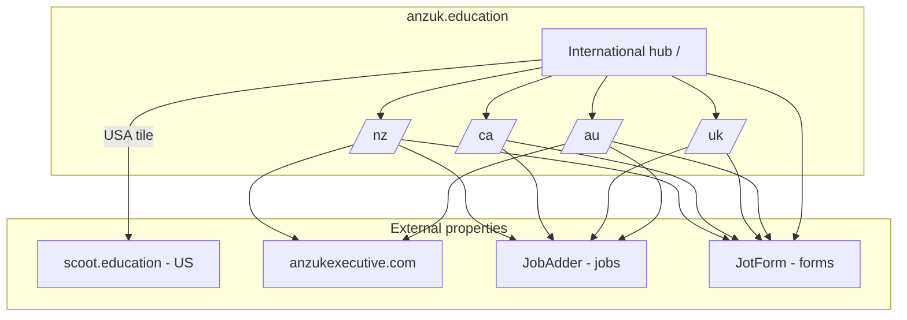

# Site map — top level

## Architecture

## Markets

| Market | URL prefix | WordPress theme | Role |
|--------|------------|-----------------|------|
| International | `/` | `anzuk-home` | Global schools brand — international teaching, leadership search, school recruitment |
| Australia | `/au/` | `anzuk-education` | Full-service local recruitment |
| United Kingdom | `/uk/` | `anzuk-education` | Supply, permanent, SEN, travel programmes |
| Canada | `/ca/` | `anzuk-education` | Lean site — cross-market teaching focus |
| New Zealand | `/nz/` | `anzuk-education` | Local + international educator support |
| United States | `scoot.education` | — | Separate brand; linked from international homepage |

## International hub — core pages

| Path | Title (approx) | Page type |
|------|----------------|-----------|
| `/` | Home - ANZUK Education | `home-international` |
| `/international-teaching-jobs/` | International teaching jobs | `service-educators` |
| `/browse-jobs/` | Search international teaching jobs | `job-listing` |
| `/teacher-recruitment-for-school/` | Teacher recruitment for school | `service-schools` |
| `/school-leadership-search/` | School leadership search | `service-leadership` |

## Regional site — shared patterns

Most regional sites share these page types (not all markets have every page):

| Pattern | Example path | Page type |
|---------|--------------|-----------|
| Regional home | `/{market}/` | `home-regional` |
| Who we are | `/{market}/who-we-are/` | `about` |
| Meet the team | `/{market}/who-we-are/meet-the-team/` | `team-listing` |
| Blog archive | `/{market}/blog/` | `blog-listing` |
| Blog article | `/{market}/blog/{slug}/` | `blog-article` |
| Browse jobs | `/{market}/browse-jobs/` | `job-listing` |
| Job detail | `/{market}/browse-jobs/{slug}/` | `job-detail` (JobAdder) |
| Register to teach | `/{market}/register-to-teach/` | `form-landing` |
| Contact us | `/{market}/contact-us/` | `contact` |
| FAQs | `/{market}/faqs/` | `faq` |
| Policies | `/{market}/policy/` | `policy` |
| Privacy policy | `/{market}/policy/privacy-policy/` | `policy` |
| Ready2Work | `/{market}/ready2work/` | `product` |
| Teach abroad | `/{market}/teach-in-{market}/` | `cross-market` |

## Regional complexity (as-is)

| Market | Top-level nav pages | Notes |
|--------|---------------------|-------|
| International | 5 | Schools-facing; geo-redirect banner to local sites |
| Australia | ~20 | Richest tree — sectors, casual/permanent hubs, Growth Hub |
| United Kingdom | ~12 nav + extras | Featured jobs, Apple a Day, travel programmes |
| Canada | ~12 | Leanest regional site |
| New Zealand | ~18 | Four-step process, refer & earn, partner pages |

## Homepage content blocks (international)

Sections identified on `/`:

- Hero with CTAs (schools enquiry, leadership search, search jobs)
- Geo-redirect banner (15s to local recruitment site)
- Country/region grid (AU, UK, CA, USA→Scoot, NZ)
- Two-column CTAs (educators / schools)
- Video accordion sections
- Partner school logo carousel
- BE GREAT values grid (7 values)

These inform future Strapi block components; the prototype uses placeholder blocks for now.
